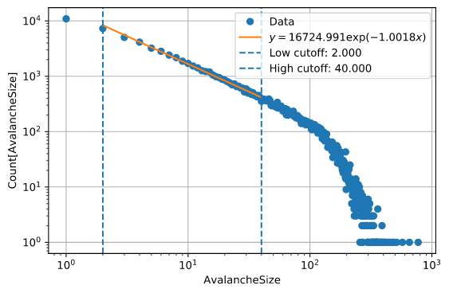
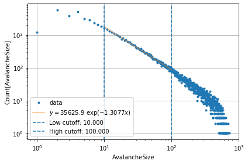
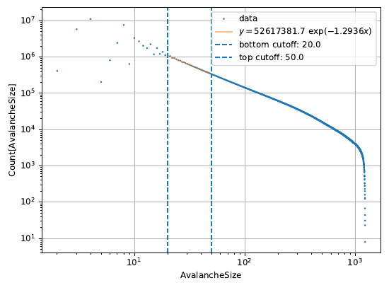

# Self-Organized Criticality Simulation (SocSim)

[](https://www.fuw.edu.pl/)

[](https://socsim.readthedocs.io/en/latest/?badge=latest)
[](https://travis-ci.com/SocSIM/SocSIM)
[](https://codecov.io/gh/SocSIM/SocSIM)


Project is created as part of subject: [Team student projects Faculty of Physics](https://sites.google.com/a/uw.edu.pl/zps/)

Programs in Python that simulate dynamical systems that have a critical point as an attractor. So called [__self-organized criticality__(SOC)](https://en.wikipedia.org/wiki/Self-organized_criticality)

## 1. Theoretical problem description

[Self-organized criticality wiki](https://en.wikipedia.org/wiki/Self-organized_criticality):   
> In physics, self-organized criticality (SOC) is a property of __dynamical systems__ that have a __critical point__ as an attractor. Their macroscopic behavior thus displays the spatial or temporal scale-invariance characteristic of the critical point of a phase transition, but without the need to tune control parameters to a precise value, because the system, effectively, tunes itself as it evolves towards criticality.

> The concept was put forward by Per Bak, Chao Tang and Kurt Wiesenfeld ("BTW") in a paper published in 1987 in Physical Review Letters, and is considered to be one of the mechanisms by which complexity arises in nature. Its concepts have been enthusiastically applied across fields as diverse as geophysics, physical cosmology, evolutionary biology and ecology, bio-inspired computing and optimization (mathematics), economics, quantum gravity, sociology, solar physics, plasma physics, neurobiology and others.

> SOC is typically observed in slowly driven non-equilibrium systems with a large number of degrees of freedom and strongly nonlinear dynamics. Many individual examples have been identified since BTW's original paper, but to date there is no known set of general characteristics that guarantee a system will display SOC.

## 2. Program structure, installation and use cases

### 2.1 Project folder structure

Project folder structure is inspired by these sources:
[sources1](https://stackoverflow.com/questions/193161/what-is-the-best-project-structure-for-a-python-application)
[source2](https://dev.to/codemouse92/dead-simple-python-project-structure-and-imports-38c6) and [Kwant](https://kwant-project.org/) project.

#### socsim:  

+ __docsrc__ - holds [Sphinx](http://www.sphinx-doc.org/en/master/) scripts used for documentation generation.
+ __docs__ - GitHub [configuration folder](https://help.github.com/en/articles/configuring-a-publishing-source-for-github-pages), which holds [web-page](https://github.com/SocSIM/SocSIM) of project.
+ __resource__ - Non executable files.
+ __results__ - folder used for holding results of simulation, _Jupiter_ notebooks and different use cases.
+ __SOC__ - main project folder, which holds all source code.
   + __models__ - contains different SOC models, like: Abelian sandpile model, forest-fire model, etc..
   + __common__ - common code between all models
   + __tests__ - unit tests of code


### 2.2 Installation and dependencies

#### Dependencies

Mostly numerical libraries, visualsation, web page generation etc.
For whole list take a look at [requirements.txt](requirements.txt)


### 2.3 Use cases

#### Running program

Program is designed in next way: 

+ Framework part - placed under `SOC` folder.
+ Research part - consists of jupyter notebooks(which can be easily deployed to web-page) and is placed under `research folder`

#### Developing the program

use `python setup.py develop` to install a basic set of dependencies and link the package to be importable in your current Python environment.

#### Running test cases
To make folder SOC an import package, run only once:
```
python setup.py develop
```
After that, simply use `pytest SOC` to automatically find and execute all existing test cases.

#### Web-page generation

Web page is generated using Sphinx library.

Under terminal enter into `docsrc` folder and type:
```cmd
make html
```
Web-page will be generated into `./docsrc/build/html` folder.
If you want to update web-page, copy generated web-page into `/docs` folder.

## Results

### [BTW](https://socsim.readthedocs.io/en/latest/BTW.html)



### [Manna model(Abelian/non-Abelian)](https://socsim.readthedocs.io/en/latest/Manna_example.html)



### [OFC](https://socsim.readthedocs.io/en/latest/OFC.html)



### [Forest fire](https://socsim.readthedocs.io/en/latest/ForestFire.html)


## Summary of intial goals:

+ Make wide coverage of all self-organized criticality models.
+ Figuring out the best algorithms. 
   + Easy scaling on many processors machine(multithreading, [GPGPU](https://en.wikipedia.org/wiki/General-purpose_computing_on_graphics_processing_units), CUDA, [numba](http://numba.pydata.org/)). 
+ Using some best practice of programming:
   + [Coding conventions](https://en.wikipedia.org/wiki/Coding_conventions)
   + Unit Tests.
   + Creation of common modules.
   + Automatic documentation generation.
   + Readability of code and easy of use(between clarity and speed, we should choose clarity).   

### 0.2 Commitments

Here are described code formatting style and other conventions, to make code more _uniform_. Also this section is for newcomers and contributors.

#### Unit Tests

SocSim uses the lovely [PyTest](https://docs.pytest.org/en/latest/) for its unit testing needs. Tests are run automatically on every commit using TravisCI.
 
#### Documentation

Most popular documentation generator for Python - [Sphinx](http://www.sphinx-doc.org/en/master/). Good tutorial about using Sphinx [here](https://sphinx-tutorial.readthedocs.io/). [Here](https://sphinxcontrib-napoleon.readthedocs.io/en/latest/example_google.html) is example of good Google style docstring standardized by PEP-484.

```bash
pip install -U sphinx
pip install sphinx_rtd_theme
pip install nbsphinx
```
[pandoc](https://pandoc.org/installing.html)

Dependencies of sphinx: `recommonmark`.

## What's next?

+ How we can apply [Keras](https://github.com/keras-team/keras)? Predictions, finding hidden parameters, etc.
+ More tests for the batch processes running (Dask)
+ Convenient selection of different boundary conditions of a system (lattice)
+ Parametrization of the earthquake model for the coverage of wider selection of submodels (by including eg.: drive with random loading, toppling to the neighbours in a specific state (crack model), delay of the fracture initiation, threshold for the fracture propagation) like in [Lomnitz-Adler (1993)](https://doi.org/10.1029/93JB01390)
+ Database of the simulations

## 3. Links/References

+  Bak, P., Tang, C. and Wiesenfeld, K. (1987). "Self-organized criticality: an explanation of 1/f noise". Physical Review Letters. 59 (4): 381–384. Bibcode:1987PhRvL..59..381B. doi:10.1103/PhysRevLett.59.381. PMID 10035754. Papercore summary: http://papercore.org/Bak1987.   
+ [Abelian sandpile model](https://en.wikipedia.org/wiki/Abelian_sandpile_model)   
+ [Forest-fire model](https://en.wikipedia.org/wiki/Forest-fire_model)   
+ [Theoretical Models of Self-Organized Criticality (SOC) Systems](https://arxiv.org/abs/1204.5119)   
+ [Pink noise](https://en.wikipedia.org/wiki/Pink_noise)   
+ [Introduction to Self-Organized Criticality & Earthquakes](http://www2.econ.iastate.edu/classes/econ308/tesfatsion/SandpileCA.Winslow97.htm)   
+ [25 Years of Self-Organized Criticality: Solar and Astrophysics](https://arxiv.org/pdf/1403.6528.pdf)
+ [SOC computer simulations](https://arxiv.org/abs/1301.2918)
  + [Studies in self-organized criticality](http://wwwf.imperial.ac.uk/~pruess/publications/thesis_final/thesis_book.pdf)
+ [Theoretical Models of SOC Systems](https://arxiv.org/pdf/1204.5119.pdf)
