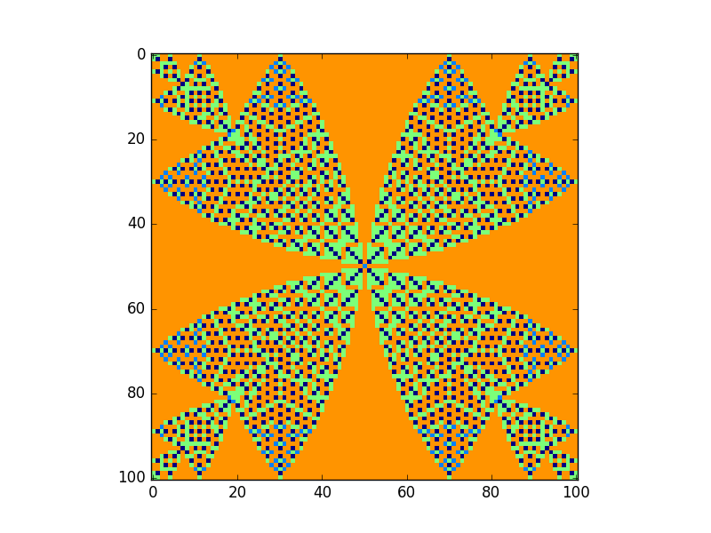

.. _sphinxtest:

################
reStructuredText
################

Links
================

source:

* `Official rst documentaion <http://docutils.sourceforge.net/docs/user/rst/quickref.html#inline-markup>`_
* `Full rst documentation <http://docutils.sourceforge.net/docs/ref/rst/restructuredtext.html#inline-markup>`_
* http://www.sphinx-doc.org/en/master/usage/restructuredtext/basics.html
* https://devguide.python.org/documenting/

*italic*
**bold**

or you can type \*bold\*

`OpenAlea wiki <www.openalea.gforge.inria.fr>`_

`OpenAlea wiki`_

Lists
=====

* la
* ra
* ba

Or numerated list

1. la
2. ra
3. ba

Nested:

* this is
* a list

  * with a nested list
  * and some subitems

* and here the parent list continues

Definition list:
================

term (up to a line of text)
   Definition of the term, which must be indented

   and can even consist of multiple paragraphs

next term
   Description.

Literal Blocks:
===============

This is a normal text paragraph. The next paragraph is a code sample::

    It is not processed in any way, except
    that the indentation is removed.

    It can span multiple lines.

This is a normal text paragraph again.

Doctest blocks
==============

>>> 1 + 1
2
lallala
>>> sin(Pi)

>>> lalalal

Tables
======

Full table 
------------

+------------------------+------------+----------+----------+
| Header row, column 1   | Header 2   | Header 3 | Header 4 |
| (header rows optional) |            |          |          |
+========================+============+==========+==========+
| body row 1, column 1   | column 2   | column 3 | column 4 |
+------------------------+------------+----------+----------+
| body row 2             | ...        | ...      |          |
+------------------------+------------+----------+----------+

Simple table 
------------

=====  =====  =======
A      B      A and B
=====  =====  =======
False  False  False
True   False  False
False  True   False
True   True   True
=====  =====  =======

Hyperlinks
==========

Use `Link text <https://domain.invalid/>`_ for inline web links

This is a paragraph that contains `a link`_.

.. _a link: https://domain.invalid/

Sections
========

* \# with overline, for parts
* \* with overline, for chapters
* \=, for sections
* \-, for subsections
* \^, for subsubsections
* \", for paragraphs

Subsection
----------

Subsubsections
^^^^^^^^^^^^^^

Paragraph
"""""""""

Some other features
===================

Field list
----------

Roles
-----

Explicit Markup
---------------

Directives
----------

A directive (ref) is a generic block of explicit markup.

Admotions
^^^^^^^^^

.. attention:: 
    Some text of attentions is going here.

.. caution:: 
    Some text of caution is going here.

.. danger:: 
    Some text of danger is going here.

.. error:: Error title

    Some text of error is going here.

.. hint:: 
    Some text of hint is going here.

.. important:: 
    Some text of important is going here.

.. tip:: 
    Some text of tip is going here.

.. note:: 
    This is a note admonition.
    This is the second line of the first paragraph.

    - The note contains all indented body elements
      following.

    - It includes this bullet list.

.. warning:: 
    Some text of warning is going here.

Images
^^^^^^

Figure
""""""

    This is the caption of the figure (a simple paragraph).

    The legend consists of all elements after the caption.

Image
"""""

Some text goes here
and here. Some text. Some text. Some text. Some text. Some text.
and here. Some text. Some text. Some text. Some text. Some text.
and here. Some text. Some text. Some text. Some text. Some text.
and here. Some text. Some text. Some text. Some text. Some text.
and here. Some text. Some text. Some text. Some text. Some text.

Additional body elements
^^^^^^^^^^^^^^^^^^^^^^^^

Table of Contents
"""""""""""""""""

.. contents:: Table of Contents

Topic
"""""

.. topic:: Topic Title

    Subsequent indented lines comprise
    the body of the topic, and are
    interpreted as body elements.

Sidebar
"""""""

.. sidebar:: Sidebar Title
   :subtitle: Optional Sidebar Subtitle

   Subsequent indented lines comprise
   the body of the sidebar, and are
   interpreted as body elements.

Code
""""

.. code:: python

    def my_function():
        """just a test"""
        print(8/2)

Math
""""

.. math::

  α_t(i) = P(O_1, O_2, … O_t, q_t = S_i λ)

Epigraph
""""""""

.. epigraph::

    No matter where you go, there you are.

    -- Buckaroo Banzai

CSV-Table
"""""""""

.. csv-table:: Frozen Delights!
    :header: "Treat", "Quantity", "Description"
    :widths: 15, 10, 30

    "Albatross", 2.99, "On a stick!"
    "Crunchy Frog", 1.49, "If we took the bones out, it wouldn't be
    crunchy, now would it?"
    "Gannet Ripple", 1.99, "On a stick!"

HTML-Meta
"""""""""

.. meta::
   :description: The reStructuredText plaintext markup language
   :keywords: plaintext, markup language

Footnotes
=========

Lorem ipsum [#f1]_ dolor sit amet ... [#f2]_

.. rubric:: Footnotes

.. [#f1] Text of the first footnote.
.. [#f2] Text of the second footnote.

Citations
=========

Are global can be referenced from any file.

Lorem ipsum [Ref]_ dolor sit amet.

.. [Ref] Book or article reference, URL or whatever.

Comments
========

.. This is a comment.

..
   This whole indented block
   is a comment.

   Still in the comment.

Code docstring
==============

.. py:function:: 
    enumerate(sequence[, start=0])

    Return an iterator that yields tuples of an index and an item of the
    *sequence*. (And so on.)

.. function:: 
    enumerate(sequence[, start=0])

    Return an iterator that yields tuples of an index and an item of the
    *sequence*. (And so on.)

The :py:func:`enumerate` function can be used for ...

.. py:function:: enumerate(sequence[, start=0])

   Return an iterator that yields tuples of an index and an item of the
   *sequence*. (And so on.)

Indices and tables
==================

* :ref:`genindex`
* :ref:`modindex`
* :ref:`search`

Autodoc
===================

SOC
---

.. automodule:: SOC
   :members: 

SocSim avalance
---------------

.. automodule:: SOC.models.avalanches
   :members:

SocSIM
------

.. automodule:: socsim
    :members:
    :noindex: